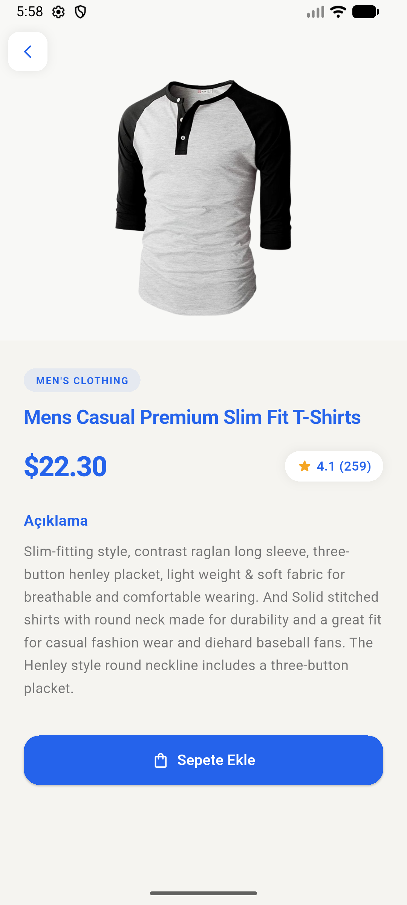
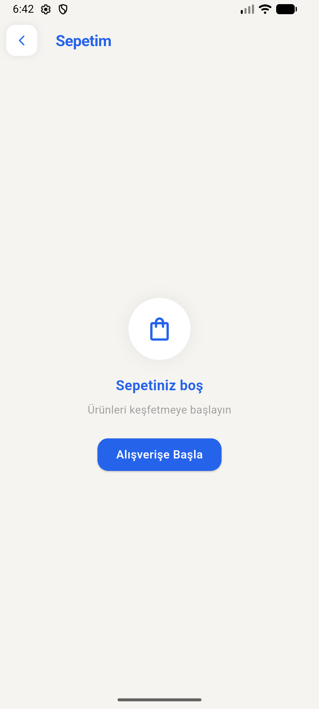
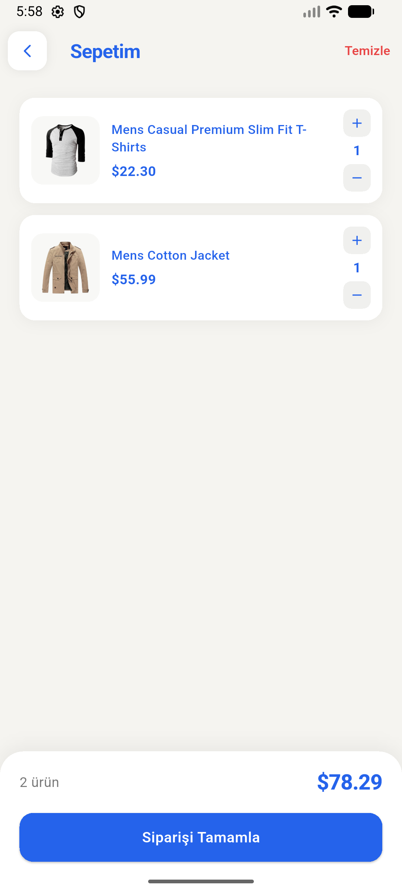

# Mini Katalog Uygulaması 📱

Bu proje, 5 günlük yoğunlaştırılmış Flutter eğitimi kapsamında geliştirilen, temel widget yapılarını, navigasyon mantığını ve veri modellemeyi içeren bir mobil uygulama taslağıdır.

---

## 📝 Proje Hakkında

**Mini Katalog Uygulaması**, Flutter dünyasına giriş yaparken öğrenilen temel kavramları (Stateless/Stateful widget'lar, listeleme, sayfa geçişleri) pratiğe dökmek amacıyla tasarlanmıştır. Uygulama, dinamik bir ürün listesi sunar ve kullanıcıların ürün detaylarını incelemesine olanak tanır.

---

## 🚀 Özellikler

- **Ana Sayfa:** Kategori veya banner alanı ile kullanıcıyı karşılayan giriş ekranı
- **Ürün Listesi:** `GridView` kullanılarak oluşturulmuş, görsel ağırlıklı ürün kartları
- **Ürün Detayı:** Seçilen ürünün görsel, fiyat ve açıklama gibi detaylarının gösterildiği sayfa
- **Sepet Simülasyonu:** Temel state güncellenmesi ile sepet etkileşimi

---

## 🛠 Kullanılan Teknolojiler

| Teknoloji | Açıklama |
|-----------|----------|
| [Flutter](https://flutter.dev/) | Cross-platform UI framework (kullanılan sürüm: (3.38.4)) | 
| [Dart](https://dart.dev/) | Uygulama dili (Null Safety) |
| Visual Studio Code | Geliştirme ortamı |
| `material.dart` | Temel UI bileşenleri |

---

## 📁 Proje Yapısı

```text
lib/
├── models/        # Veri modelleri (Product model vb.)
├── screens/       # Uygulama sayfaları (Home, Detail vb.)
├── widgets/       # Tekrar kullanılabilir UI bileşenleri
├── viewmodels/    # İş mantığı ve state yönetimi
├── services/      # Veri kaynağı ve servis katmanı
└── main.dart      # Uygulama giriş noktası
```

---

## ⚙️ Kurulum ve Çalıştırma

### Gereksinimler

- [Flutter SDK](https://docs.flutter.dev/get-started/install) (3.x ve üzeri)
- [Dart SDK](https://dart.dev/get-dart) (Flutter ile birlikte gelir)
- Visual Studio Code veya Android Studio
- Bağlı bir fiziksel cihaz ya da emülatör

### Adımlar

1. **Depoyu klonlayın:**

   ```bash
   git clone https://github.com/kullanici-adi/mini-katalog.git
   cd mini-katalog
   ```

2. **Bağımlılıkları yükleyin:**

   ```bash
   flutter pub get
   ```

3. **Cihaz veya emülatörü başlatın ve uygulamayı çalıştırın:**

   ```bash
   flutter run
   ```

4. **(İsteğe bağlı) Release build almak için:**

   ```bash
   flutter build apk --release
   ```

---

## 📸 Ekran Görüntüleri

| Ana Sayfa | Ürün Detayı | Sepet (Boş) | Sepet |
|:---------:|:------------:|:-----------:|:-----:|
|  |  |  |  |
